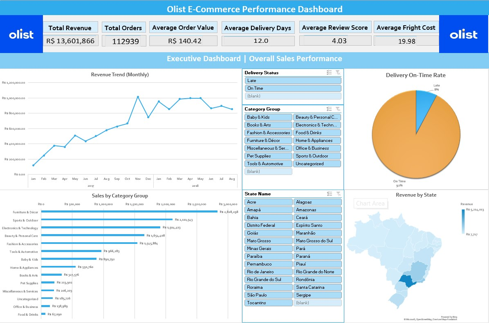
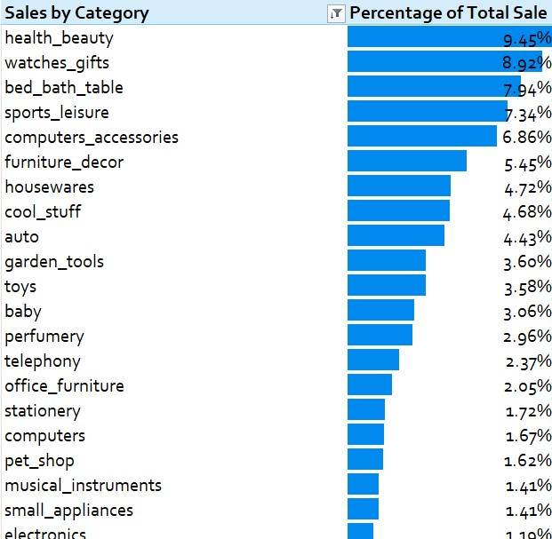
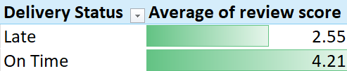

#  Olist E-Commerce Brazilian Sales Analysis

*Snapshot of the Interactive Dashboard (Excel)*

##  Business Problem & Project Objectives

**The Problem:**
Olist, a Brazilian e-commerce marketplace, operates in a challenging logistics environment where delivery delays directly impact customer retention. The company lacks visibility into how these logistics inefficiencies affect brand reputation (Review Scores) and needs to identify which product categories drive the majority of revenue to optimize inventory management.

**My Objectives:**
To address these challenges, I analyzed **100,000+ order records** to:
1.  **Quantify the cost of delay:** Measure exactly how much late deliveries damage customer satisfaction scores.
2.  **Identify revenue drivers:** Determine which product categories constitute the "Vital Few" (Pareto Principle) to focus inventory efforts.
3.  **Analyze seasonal trends:** Investigate sales anomalies, such as the 2018 sales flatline, to understand external market threats.
4.  **Recommend strategic actions:** Provide data-driven suggestions to improve logistics reliability and reduce churn.

After data exploration and cleaning, I visualized critical findings regarding the "Logistics Gap" and sales seasonality. I designed an interactive **Dashboard** using pre-attentive attributes (color/contrast) to highlight KPIs, allowing stakeholders to filter insights by State and Category dynamically.

##  About the Dataset
The data was sourced from the **[Brazilian E-Commerce Public Dataset by Olist](https://www.kaggle.com/datasets/olistbr/brazilian-ecommerce)** on Kaggle. 
*   **Description:** This is real commercial data (anonymized) comprising 100,000 orders made at multiple marketplaces in Brazil.
*   **Scope:** It connects the order lifecycle from purchase to delivery, including customer reviews, seller location, product attributes, and geolocation data.
    * Tables: 9 (Relational CSVs including Orders, Customers, Reviews, Products)
    * Rows: 99,441 Orders (before filtering)
*   **Timeline:** 2016 to 2018 (Analysis focuses on the 2017-2018 mature period).

##  Tools & Strategy

### Why Excel?
While Python or SQL are standard for large datasets, this project was **deliberately built in Excel** to demonstrate:
1.  **Stakeholder Accessibility:** Creating a "low-code" tool that business executives can interact with immediately, without needing a Python environment or SQL access.
2.  **Advanced Data Modeling:** showcasing the use of **Power Query** and **Data Models** to handle 100k+ rows efficiently, bypassing standard spreadsheet limitations.

### Workflow
*   **Data Cleaning (Power Query):** Merged multiple relational tables (Orders, Reviews, Customers, Geolocation, Products) and standardized data types.
*   **Feature Engineering:** Created custom metrics including `Delivery_Time_Days`, `Delivery_Status` (On-Time vs. Late), and `Category_Groups`(reducing 74 Categories to 14 Category_groups).
*   **Data Modeling:** Utilized Pivot Tables and Data Models to aggregate millions of data points into dynamic KPIs.
*   **Visualization:** Designed a professional dynamic Dashboard using Slicers, Linked Pictures, and Geographic Heat Maps.

##  Key Findings

### 1. Revenue Concentration
The business relies heavily on a few core segments. The top three macro-categories (**Health & Beauty**, **Watches & Gifts**, and **Bed, Bath & Table**) generated  **26%** of the grand total revenue during the analyzed timeline. This indicates a strong market fit in these specific niches but exposes the business to risk if these specific categories underperform.

*Figure 1: Top 3 categories drive over a quarter of total revenue.*

### 2. The "Logistics Gap"
Analysis reveals a sharp contrast in customer satisfaction based on delivery performance.
*   **On-time deliveries:** Average Review Score of **4.21/5** (Avg delivery time: 10.4 days).
*   **Delayed deliveries:** Average Review Score decreases to **2.55/5** (Avg delivery time: 30.9 days).
*   **Statistical Validation:** Calculated a negative correlation coefficient of **r = -0.31**. While product quality remains the primary driver of satisfaction, this result confirms that delivery delays are a statistically significant drag on customer sentiment.

 

*Figure 2: Late deliveries correlate with a massive 1.66-star drop in satisfaction.*

### 3. Monthly Revenue Trend
The sales data displays a clear upward trend from Jan 2017 to Aug 2018, with a distinct peak in November, likely driven by Black Friday promotions. However, there is a notable seasonal pattern showing a sales decline of **almost 14% from May to June** in both 2017 and 2018, which requires further root cause analysis to mitigate future Q2 slumps.

##  Recommendations

1.  **Optimize "Last Mile" Logistics:** Olist should Investigate carrier performance in states with the highest "Late Delivery" rates and or develop a predictive SLA breach algorithm. Reducing late deliveries by just 50% could potentially increase the overall Average Review Score, driving higher customer trust and repeat purchases.

2.  **Targeted Inventory Focus:** Prioritizing stock availability and supplier relationships specifically for **Health & Beauty**, **Watches & Gifts**, and **Bed, Bath & Table** to prevent stockouts in these critical segments.

3.  **Seasonal Retention Strategy:** Launching a dedicated "Post-May" investigation task force. If no concrete result was found, counter it with mid-year promotions or loyalty incentives.

##  Skills Showcased
The technical skills and concepts applied in this project include:
*   **Data Cleaning & ETL:** Power Query (M Language), Data Type Standardization, Merging Queries.
*   **Data Modeling:** Relational Schemas, Measure Creation (KPIs), Calculated Columns.
*   **Analysis:** Statistical Correlation, Trend Analysis, Pareto Principle (80/20 Rule).
*   **Visualization:** Dashboard Design, Slicers, Geographic Maps, Conditional Formatting, Interactive UI.

---
###  Project Files
*   **[Download Project File (Excel)](https://docs.google.com/spreadsheets/d/10fxGrWl1Hgm6WK1cin0v4wGfU9LSxsBL/edit?usp=sharing&ouid=116764094025151136870&rtpof=true&sd=true)**: The complete Excel model (Hosted on Google Drive due to GitHub size limits).
*   **ETL Automation:** The full Power Query M-Code logic is available in `power_query_etl.m` for technical review.
*   `dashboard_overview.jpg`: preview of the final output.

