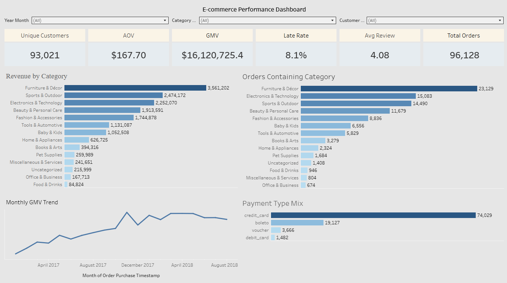
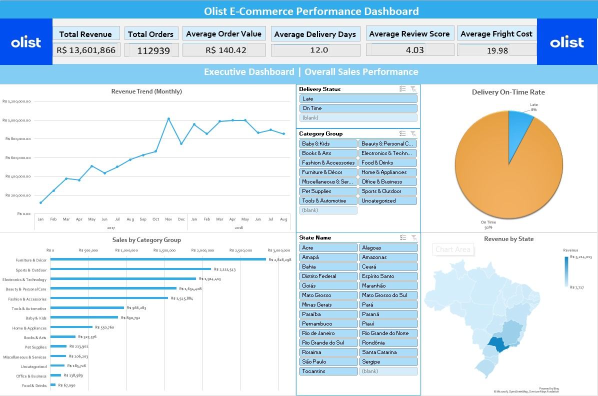
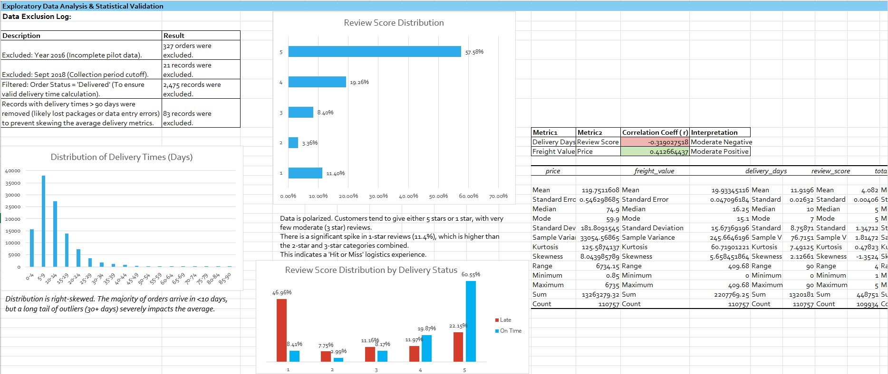
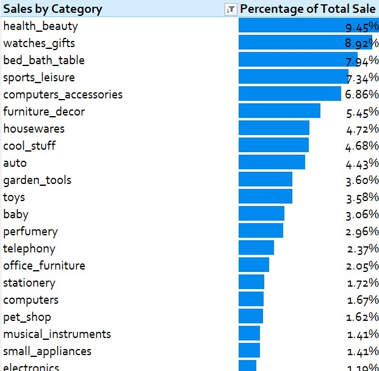
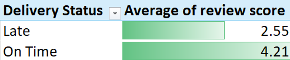

# Olist E-Commerce Brazilian Sales Analysis

**Tools:** Excel | Power Query | SQL (BigQuery) | Tableau Public

**Live Dashboard:** [Open the interactive Tableau dashboard](https://public.tableau.com/views/OlistE-commercePerformanceDashboard_17739255935960/E-commercePerformanceDashboard?:language=en-US&:sid=&:redirect=auth&:display_count=n&:origin=viz_share_link)
**Project File:** [Download the Excel dashboard](https://github.com/Arash-hadi-D/Olist-Ecommerce-Sales-Analysis/releases/download/V1.0/Olist_Sales_Dashboard_Analysis.xlsx)  
**Validation Logic:** [`olist_analysis_sql.sql`](olist_analysis_sql.sql) | [`power_query_etl.pq.txt`](power_query_etl.pq.txt)

## Project Summary

This project analyzes 100k+ Brazilian e-commerce orders from Olist to understand revenue concentration, customer satisfaction, and fulfillment performance. The original solution was built in Excel with Power Query and SQL validation. A second Tableau Public dashboard was added to present the same cleaned data in a recruiter-friendly BI format.

*Final Tableau dashboard built from the cleaned Olist dataset. This complements the original Excel dashboard with an e-commerce KPI view focused on GMV, AOV, customer count, late rate, and payment mix.*

*Original interactive Excel dashboard built with Power Query, Pivot modeling, and slicers.*

##  Business Problem & Project Objectives

**The Problem:**
Olist, a Brazilian e-commerce marketplace, operates in a challenging logistics environment where delivery delays directly impact customer retention. The company lacks visibility into how these logistics inefficiencies affect brand reputation (Review Scores) and needs to identify which product categories drive the majority of revenue to optimize inventory management.

**My Objectives:**
To address these challenges, I analyzed **100,000+ order records** to:
1.  **Quantify the cost of delay:** Measure exactly how much late deliveries damage customer satisfaction scores.
2.  **Identify revenue drivers:** Determine which product categories constitute the "Vital Few" (Pareto Principle) to focus inventory efforts.
3.  **Analyze seasonal trends:** Investigate sales anomalies, such as the 2018 sales flatline, to understand external market threats.
4.  **Recommend strategic actions:** Provide data-driven suggestions to improve logistics reliability and reduce churn.

After data exploration and cleaning, I visualized critical findings regarding the "Logistics Gap" and sales seasonality. I designed an interactive **Dashboard** on Excel using pre-attentive attributes (color/contrast) to highlight KPIs, allowing stakeholders to filter insights by State and Category dynamically.

##  About the Dataset
The data was sourced from the **[Brazilian E-Commerce Public Dataset by Olist](https://www.kaggle.com/datasets/olistbr/brazilian-ecommerce)** on Kaggle. 
*   **Description:** This is real commercial data (anonymized) comprising 100,000 orders made at multiple marketplaces in Brazil.
*   **Scope:** It connects the order lifecycle from purchase to delivery, including customer reviews, seller location, product attributes, and geolocation data.
    * Tables: 9 (Relational CSVs including Orders, Customers, Reviews, Products)
    * Rows: 99,441 Orders (before filtering)
*   **Timeline:** 2016 to 2018 (Analysis focuses on the 2017-2018 mature period).

##  Technical Approach & Strategy

### Why Excel + SQL?
This project combines the **analytical power of SQL** with the **accessibility of Excel**. The dashboard was built in Excel to allow non-technical stakeholders to interact with the data, while **SQL (BigQuery)** was used for backend data validation and quality assurance.

### Workflow
*   **Data Cleaning (Power Query):** Merged multiple relational tables (Orders, Reviews, Customers, Geolocation, Products) and standardized data types.
*   **Feature Engineering:** Created precision metrics including `Delivery_Time_Days` (**using `Duration.TotalDays` to capture fractional time vs. integer rounding**), `Delivery_Status` (On-Time vs. Late), and `Category_Groups`(reducing 74 Categories to 14 Category_groups).
*   **Data Modeling:** Utilized Pivot Tables and Data Models to aggregate millions of data points into dynamic KPIs.
*   **Visualization:** Designed a professional dynamic Dashboard using Slicers, Linked Pictures, and Geographic Heat Maps.

###  Exploratory Data Analysis (EDA)
An internal `EDA_&_Stats` sheet was created to validate assumptions:
*   **Distribution Analysis:** Confirmed a "Long Tail" of late deliveries (20-90 days) using histograms.
*   **Outlier Removal:** Filtered 2,500+ records with order status not being delivered and capped delivery time at 90 days to ensure metric stability.
*   **Sentiment Analysis:** Identified a "J-Curve" in reviews. While on-time orders have high satisfaction, **46.3% of late orders receive a 1-star rating**, proving that customers punish delivery delays with the lowest possible score.

##  Technical Implementation: Excel & SQL Dual-Validation

To ensure data integrity, I implemented a **Dual-Validation Strategy**. While the final dashboard is built in Excel for stakeholder accessibility, the core logic was first prototyped and rigorously tested using **SQL (BigQuery)**.

**Why SQL?**
I used SQL to "stress test" the Excel calculations, ensuring that complex metrics like *Delivery Time* and *Review Score Correlations* were accurate across 100,000+ rows.

**Key SQL Logic Used:**
*   **CTEs (Common Table Expressions):** Used to pre-filter the dataset (removing 2016 data and >90-day outliers) before aggregation, replicating the Power Query "M" logic.
*   **Feature Engineering:** Calculated `delivery_status` flags ("Late" vs "On-Time") using `CASE` statements to verify the "Logistics Gap" findings.
*   **Window Functions & Aggregation:** Validated the "Top 3 Categories" ranking to ensure no revenue was dropped during the multi-table joins.

*(See the full validation script in `olist_analysis_sql.sql`)*

##  Key Findings

### 1. Revenue Concentration
The business relies heavily on a few core segments. The top three macro-categories (**Health & Beauty**, **Watches & Gifts**, and **Bed, Bath & Table**) generated  **26%** of the grand total revenue during the analyzed timeline. This indicates a strong market fit in these specific niches but exposes the business to risk if these specific categories underperform.

*Figure 1: Top 3 categories drive over a quarter of total revenue.*

### 2. The "Logistics Gap"
Analysis reveals a sharp contrast in customer satisfaction based on delivery performance.
*   **On-time deliveries:** Average Review Score of **4.21/5** (Avg delivery time: 10.8 days).
*   **Delayed deliveries:** Average Review Score decreases to **2.55/5** (Avg delivery time: 30.3 days).
*   **Statistical Validation:** Calculated a negative correlation coefficient of **r = -0.31**. While product quality remains the primary driver of satisfaction, this result confirms that delivery delays are a statistically significant drag on customer sentiment.

 

*Figure 2: Late deliveries correlate with a massive 1.66-star drop in satisfaction.*

### 3. Monthly Revenue Trend
The sales data displays a clear upward trend from Jan 2017 to Aug 2018, with a distinct peak in November, likely driven by Black Friday promotions. However, there is a notable seasonal pattern showing a sales decline of **almost 14% from May to June** in both 2017 and 2018, which requires further root cause analysis to mitigate future Q2 slumps.

##  Recommendations

1.  **Optimize "Last Mile" Logistics:** Olist should Investigate carrier performance in states with the highest "Late Delivery" rates and or develop a predictive SLA breach algorithm. Reducing late deliveries by just 50% could potentially increase the overall Average Review Score, driving higher customer trust and repeat purchases.

2.  **Targeted Inventory Focus:** Prioritizing stock availability and supplier relationships specifically for **Health & Beauty**, **Watches & Gifts**, and **Bed, Bath & Table** to prevent stockouts in these critical segments.

3.  **Seasonal Retention Strategy:** Launching a dedicated "Post-May" investigation task force. If no concrete result was found, counter it with mid-year promotions or loyalty incentives.

## Key Insights from the Tableau Dashboard

- The business generated **$16.12M GMV** across **96,128 orders** from **93,021 unique customers**, with an **AOV of $167.70**, an average review score of **4.08/5**, and a **late delivery rate of 8.1%**.  
  **Suggested action:** Track late delivery rate as a core business KPI and monitor it by category, seller, and region.

- Revenue was highly concentrated in a few categories. **Furniture & Décor, Sports & Outdoor, and Electronics & Technology** contributed about **51.4% of total GMV**, while the top 5 categories generated about **74.1%**.  
  **Suggested action:** Protect top categories operationally while growing mid-tier categories to reduce concentration risk.

- **Furniture & Décor** was the strongest category overall, ranking first in both **revenue ($3.56M)** and **orders containing category (23,129)**.  
  **Suggested action:** Use it as a benchmark category to identify practices that can be replicated elsewhere.

- Monthly GMV rose from **$138k in January 2017** to **$1.20M in November 2017**, then stayed above **$1.0M** for most of 2018, indicating a shift from rapid growth to higher-volume stability.  
  **Suggested action:** Compare weaker months against peak months to identify the category and operational patterns behind stronger performance.

- Payment behavior was heavily concentrated in **credit card** usage, with **boleto** as the second most common method.  
  **Suggested action:** Optimize the checkout experience around dominant payment methods while improving secondary payment flows where useful.

- Category comparison suggests that some groups, such as **Home & Appliances**, **Fashion & Accessories**, and **Tools & Automotive**, generated relatively stronger value per order-containing-category than lower-value groups like **Food & Drinks** and **Books & Arts**.  
  **Suggested action:** Treat higher-value categories as premium growth opportunities and lower-value ones as basket-building support categories.

## Recommended Business Actions
1.  **Monitor delivery reliability as a core business KPI:** Track late rate by seller, category, and state to identify where customer experience is most exposed.
2.  **Protect top revenue-driving categories:** Strengthen supplier, inventory, and fulfillment focus in the categories that now account for most GMV.
3.  **Benchmark peak-performance months:** Use late 2017 and early 2018 as reference periods to study the conditions behind stronger commercial performance.
4.  **Optimize around dominant payment behavior:** Improve checkout flows for the most-used payment methods while testing lower-friction alternatives for secondary methods.

##  Skills Showcased
The technical skills and concepts applied in this project include:
*   **Data Cleaning & ETL:** Power Query (M Language), Data Type Standardization, Merging Queries.
   *   *Note: The full M-Code logic is available in `power_query_etl.txt` for technical review.*
*   **Data Modeling:** Relational Schemas, Measure Creation (KPIs), Calculated Columns.
*   **Analysis:** Statistical Correlation, Trend Analysis, Pareto Principle (80/20 Rule).
*   **Visualization:** Dashboard Design, Slicers, Geographic Maps, Conditional Formatting, Interactive UI.
*   **Data Validation:** compared calculation logic between Power Query (M) and SQL (BigQuery) to ensure metric consistency across platforms.

---
###  Project Files
*   **[Download Project File (Excel)](https://github.com/Arash-hadi-D/Olist-Ecommerce-Sales-Analysis/releases/download/V1.0/Olist_Sales_Dashboard_Analysis.xlsx)**: The complete Excel model
*   **ETL Automation:** The full Power Query M-Code logic is available in `power_query_etl.txt` for technical review.
*   **SQL Validation Script (olist_analysis_sql.sql):** Contains the CTEs, Joins, and Logic used to stress-test the Excel data model and verify the "Logistics Gap" findings.

