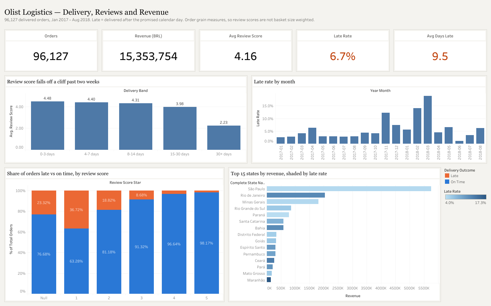
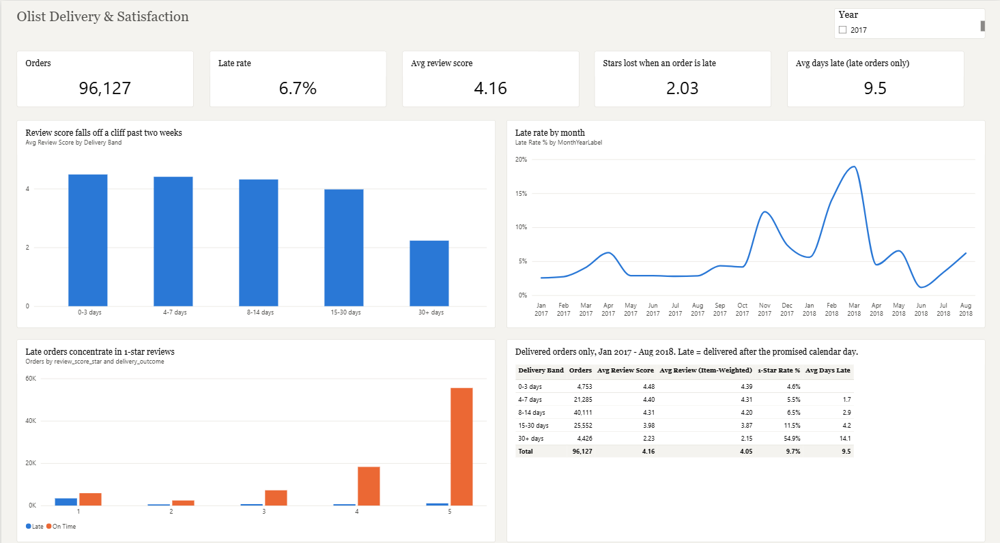
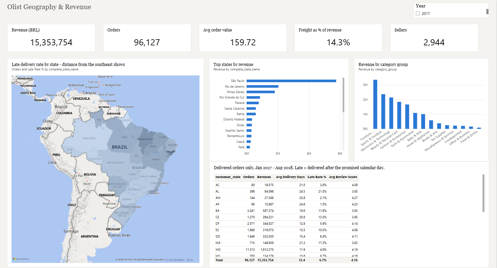
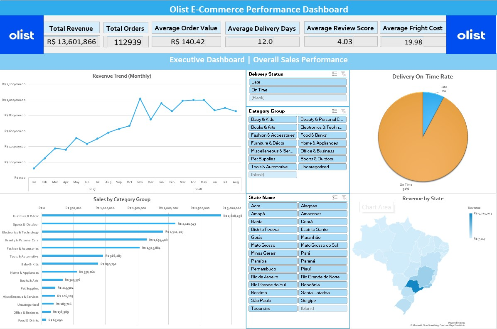
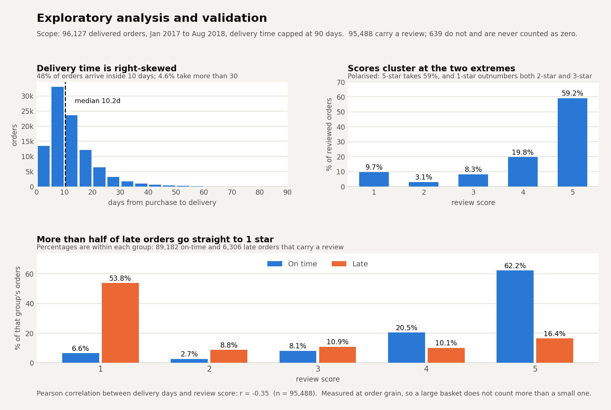
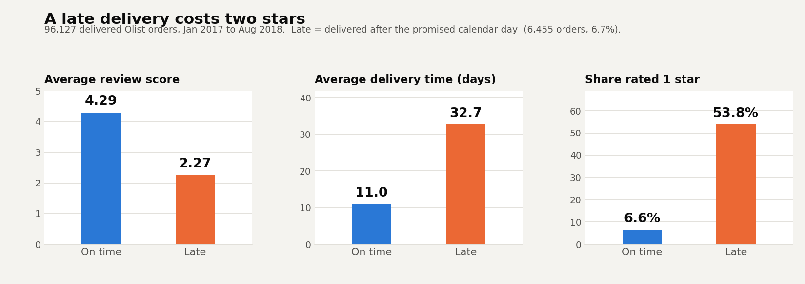
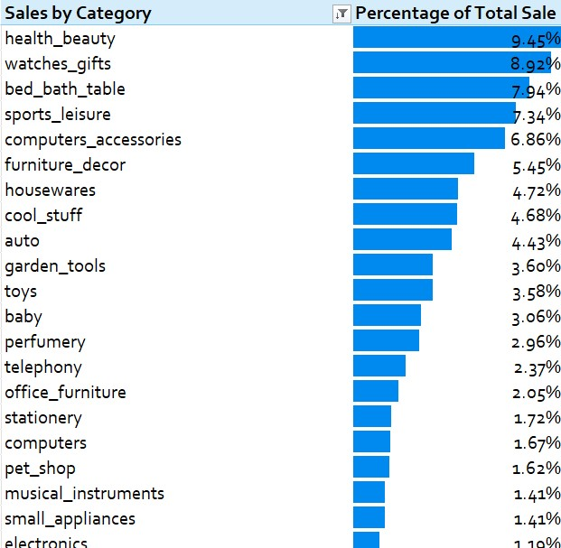

# Olist Brazilian E-Commerce: delivery, reviews and revenue

**Tools:** Excel | Power Query (M) | SQL (BigQuery) | Tableau Public | Power BI Desktop (PBIP / TMDL)

**Live Tableau dashboard:** [Olist Logistics - Corrected](https://public.tableau.com/app/profile/arash.hadi/viz/Olist_Logistics_Corrected/OlistLogistics-Corrected)

**Downloads:** [Releases page](https://github.com/Arash-hadi-D/Olist-Ecommerce-Sales-Analysis/releases), holding the packaged Tableau workbook (`.twbx`) and the Excel model (`.xlsx`).

**Code:** [`olist_analysis_sql.sql`](olist_analysis_sql.sql) · [`power_query_etl.pq.txt`](power_query_etl.pq.txt) · [`OlistDelivery.pbip`](OlistDelivery.pbip)

---

## Summary

96,127 delivered Olist orders from January 2017 to August 2018, analysed to answer one question: how much does a late delivery actually cost in customer satisfaction, and where does it happen most.

Short answer. A late order averages **2.27 out of 5** against **4.29** for an on-time one, and **53.8%** of late orders get a one-star review compared with **6.6%** of on-time orders. The damage is concentrated: six of the fifteen largest states run late rates above 10%, while São Paulo, which is 37.5% of revenue, sits at 4.5%.

The project started as an Excel and Power Query model with SQL validation. It now also ships a corrected star schema feeding a Tableau and a Power BI dashboard. The section on version 2 below explains what was wrong in the first pass and what it changed.

---

## Dashboards

### Tableau

[](https://public.tableau.com/app/profile/arash.hadi/viz/Olist_Logistics_Corrected/OlistLogistics-Corrected)

Five KPI tiles over four views: review score by delivery band, late rate by month, the late and on-time split within each star rating, and revenue by state shaded by late rate. The image links through to the interactive version.

### Power BI





Built in PBIP developer mode, so the semantic model is version-controlled as TMDL text rather than a binary `.pbix`. The measures, relationships and calculated columns are readable in `OlistDelivery.SemanticModel/definition/`. The model points at local Parquet files, so it is committed here for inspection rather than for refresh.

### Excel



The original interactive model: Power Query ETL, a pivot data model, slicers by state and category. Read its KPI tiles as v1: average review score shows 4.08, and Total Revenue of R$ 13.2M is product price with freight excluded, against R$ 15.35M including it. The workbook's `EDA_&_Stats` sheet carries a note setting out both differences.

---

## Metric definitions

Every number in this README follows these rules. They matter, because two of them changed between v1 and v2.

| Term | Definition |
|---|---|
| Order | One `order_id` with status `delivered`. Non-delivered and cancelled orders are excluded. 99,441 orders in the raw data, 96,127 after filtering. |
| Revenue | `price + freight_value` summed across order items, in **Brazilian reais (R$)**. Not payment value, which differs because of instalments and vouchers. |
| Late | Delivered after the promised **calendar day**: `date(delivered_customer_date) > date(estimated_delivery_date)`. A delivery that lands on the promised day but later on the clock counts as on time. |
| Days late | Calendar days past the promise, floored at zero, averaged over late orders only. |
| Review score | One score per order. 189 orders carried more than one review; those use the mean. |
| Category group | The 74 raw product categories collapsed into 14 groups. Where this README says "category", it says which level it means. |

---

## Version 2: what changed and why

The first version exported everything into one flat table at **order-item** grain. Order-level attributes such as review score and delivery dates were repeated once per line item, so every average silently weighted each order by how many items it contained. A four-item order counted four times as much as a single-item one.

Rebuilding on a star schema fixed it. `Fact_Order` sits at order grain, `Fact_OrderItem` at line grain, with three conformed dimensions, joined through Tableau relationships instead of a single flat extract. Each measure now aggregates at its own grain.

Separately, "late" had three competing definitions across the Excel model, the SQL script and the Tableau workbook. I reconciled them on the calendar-day rule, because that is the promise the customer actually sees.

| Metric | v1 | v2 | Cause |
|---|---|---|---|
| Average review score | 4.08 | **4.16** | Basket-size weighting removed |
| Late rate | 8.1% | **6.7%** | Timestamp comparison replaced by calendar day |
| Late orders | 7,746 | **6,455** | Same |

Neither correction is large in absolute terms. Both change the story you would tell a stakeholder, and the second one changes whether a supplier hits its SLA.

---

## Business problem and objectives

Olist is a Brazilian marketplace operating over long distances and mixed carrier quality. Delivery reliability is the part of the experience the seller does not control and the customer blames them for anyway. The company needs to know how much satisfaction a delay actually costs, and which categories and regions carry the revenue that a delay puts at risk.

What I set out to quantify:

1. The satisfaction cost of a late delivery, measured rather than assumed.
2. Where revenue concentrates, so inventory and carrier attention can follow it.
3. Whether the late rate is a national problem or a regional one.
4. What a seasonal dip in the data is worth investigating.

---

## About the dataset

Source: the [Brazilian E-Commerce Public Dataset by Olist](https://www.kaggle.com/datasets/olistbr/brazilian-ecommerce) on Kaggle. Real anonymised commercial data.

- 9 relational tables covering orders, customers, reviews, products, sellers and geolocation
- 99,441 orders before filtering, 96,127 delivered orders in scope
- Timeline 2016 to 2018. 2016 is dropped because the platform was still ramping, leaving January 2017 to August 2018
- All monetary values in Brazilian reais

---

## Technical approach

**Cleaning (Power Query).** Merged the relational tables, standardised types, and built `Delivery_Time_Days` with `Duration.TotalDays` rather than integer rounding so partial days survive. Collapsed 74 product categories into 14 groups.

**Validation (BigQuery).** The Excel logic was re-implemented in SQL and the two compared row by row. CTEs pre-filter 2016 and the delivery-time outliers to mirror the M code. `CASE` statements rebuild the delivery status flag. Window functions check that the category ranking survives the multi-table joins without dropping revenue. Full script in `olist_analysis_sql.sql`.

**Modelling (star schema).** Two fact tables and three dimensions, exported to Parquet for Power BI and to CSV for Tableau Public, which has no Parquet connector. Tableau relationships rather than joins, so each table aggregates at its own grain.

**Presentation.** Power BI in PBIP developer mode with the model authored as TMDL. Tableau Public for the shareable version. Both dashboards produce identical figures, which is the point of building the second one.

---

## Exploratory analysis

Three checks before building anything: how delivery time is distributed, how review scores are distributed, and whether the two move together.



Delivery time has a long right tail, which is why the median of 10.2 days sits well below the mean of 12.4. Review scores are polarised rather than normal, so an average on its own hides the shape of the data. Splitting that distribution by delivery outcome is what makes the correlation actionable: on-time and late orders differ in shape, not only in mean.

The same three checks in the v1 Excel model ran against a flat order-item table with a timestamp-based late flag. That is why its figures (r = −0.32, and 46.3% of late orders at one star) differ from the ones above.

---

## Key findings

### 1. Delivery time and review score break at two weeks

Average review score by delivery band:

| Delivery time | Avg review score |
|---|---|
| 0–3 days | 4.48 |
| 4–7 days | 4.40 |
| 8–14 days | 4.31 |
| 15–30 days | 3.98 |
| 30+ days | **2.23** |

The curve is flat to about two weeks and then falls off a cliff. Shaving a day off a four-day delivery buys almost nothing. Pulling a 30-day delivery under 15 days is worth roughly 1.75 stars.

### 2. Late orders get punished with the lowest score available



- On time: **4.29** average review, 11.0 days average delivery, 6.6% one-star
- Late: **2.27** average review, 32.7 days average delivery, **53.8% one-star**

Customers do not scale their anger. More than half of all late orders go straight to one star. Read the other way, the share of orders that were late within each rating runs 36.7% of one-star orders, 18.8% of two-star, 8.7% of three-star, 3.4% of four-star and 1.8% of five-star.

Pearson correlation between delivery days and review score is **r = −0.35** (n = 95,488). Product quality still dominates satisfaction, and delivery is a measurable drag on it.

### 3. Revenue is concentrated, and so is the risk

Of the 14 category groups, the top three take **51.3%** of revenue and the top five take **74.1%**.

| Category group | Revenue (R$) | Share | Orders |
|---|---|---|---|
| Furniture & Décor | 3,355,869 | 21.9% | 23,129 |
| Sports & Outdoor | 2,367,547 | 15.4% | 14,490 |
| Electronics & Technology | 2,146,418 | 14.0% | 15,083 |
| Beauty & Personal Care | 1,846,799 | 12.0% | 11,678 |
| Fashion & Accessories | 1,666,358 | 10.9% | 8,836 |

At the raw 74-category level the picture is much flatter: the top three there (`health_beauty`, `watches_gifts`, `bed_bath_table`) come to only **25.4%**. Concentration is partly a property of the grouping, so both numbers are worth quoting together.



### 4. Late delivery is a regional problem, not a national one

The top 15 states carry 94.6% of revenue. Their late rates run from 4.0% to 17.3%.

| State | Revenue (R$) | Late rate | Avg review |
|---|---|---|---|
| São Paulo | 5,752,539 | 4.5% | 4.25 |
| Rio de Janeiro | 2,042,844 | 12.1% | 3.97 |
| Minas Gerais | 1,812,375 | 4.6% | 4.19 |
| Rio Grande do Sul | 857,943 | 6.1% | 4.19 |
| Paraná | 777,997 | 4.0% | 4.24 |
| Ceará | 264,221 | 13.5% | 3.95 |
| Maranhão | 146,959 | **17.3%** | 3.83 |

Rio de Janeiro is the one that matters commercially. It is the second-largest market at 13.3% of revenue, it runs nearly three times São Paulo's late rate, and its average review is the lowest of the three big states.

### 5. Growth flattened, and May to June dips twice

Monthly revenue climbed from R$ 127k in January 2017 to a peak of R$ 1.15M in November 2017, then held above R$ 1.0M in six of the eight months of 2018. That is a shift from growth to volume stability, not a decline.

One repeating pattern: revenue fell 13.5% from May to June in 2017 and 10.4% over the same months in 2018. Two years is not a seasonal trend, but it is enough to justify looking at May promotional activity before assuming June is the problem.

---

## Recommendations

1. **Track late rate by state, not nationally.** The 6.7% headline hides Maranhão at 17.3% and Ceará at 13.5%. A national target lets the worst regions hide behind São Paulo's volume.
2. **Prioritise Rio de Janeiro.** It is the largest market where reliability is genuinely poor. Closing its 12.1% late rate toward the national average addresses more revenue than fixing every state below the top five combined.
3. **Set the SLA target at 14 days rather than at "faster".** Review score is flat below two weeks, so speed investment under that threshold does not buy satisfaction. The return is in eliminating the long tail.
4. **Protect the top five category groups operationally.** They carry 74.1% of revenue, so a stockout or a carrier failure there costs more than anywhere else.

---

## Limitations

- Delivered orders only. Cancelled and undelivered orders are excluded, so this measures satisfaction among customers who did receive something.
- Delivery time was capped at 90 days in the Power Query stage and the star schema inherits that cap, so the longest delivery in scope is 91 days. The 30+ day band is a bounded tail, not an open-ended one.
- 639 delivered orders have no review. They appear as a "Null" column in the review split chart rather than being dropped, because they are 23.3% late and dropping them would flatter the numbers.
- The star schema has no payments table, so payment-method analysis exists only in the v1 Excel model and is not carried forward.
- Correlation is not causation. A slow delivery and a bad review may share a cause, such as a seller who is poor at both.

---

## Repository structure

```
README.md
olist_analysis_sql.sql            BigQuery validation script
power_query_etl.pq.txt            Power Query M code
OlistDelivery.pbip                Power BI project (PBIP)
OlistDelivery.SemanticModel/      TMDL model: tables, measures, relationships
OlistDelivery.Report/             PBIR report definition
tableau_logistics_corrected.png   Tableau dashboard, v2
powerbi_delivery_satisfaction.png Power BI page 1
powerbi_geography_revenue.png     Power BI page 2
dashboard_overview.jpg            Excel dashboard
category_insight.JPG              Category revenue, Excel
delivery_gap.png                  On time vs late, three measures
eda_validation.png                Distributions and correlation check
```

Large binaries (`.twbx`, `.xlsx`) are attached to [releases](https://github.com/Arash-hadi-D/Olist-Ecommerce-Sales-Analysis/releases) rather than committed.

---

## Skills demonstrated

Power Query (M) for ETL and type standardisation. SQL in BigQuery for cross-platform validation with CTEs, window functions and multi-table joins. Dimensional modelling: star schema design, grain selection, conformed dimensions. DAX and TMDL in Power BI developer mode. Tableau relationships and table calculations, including a percent-of-total scoped with Compute Using to split each rating by delivery outcome. Dashboard design against a fixed palette, checked for colourblind safety.

The part worth asking me about in an interview is the grain bug. Finding it in my own published work, quantifying the error and rebuilding the model taught me more than any of the charts did.
